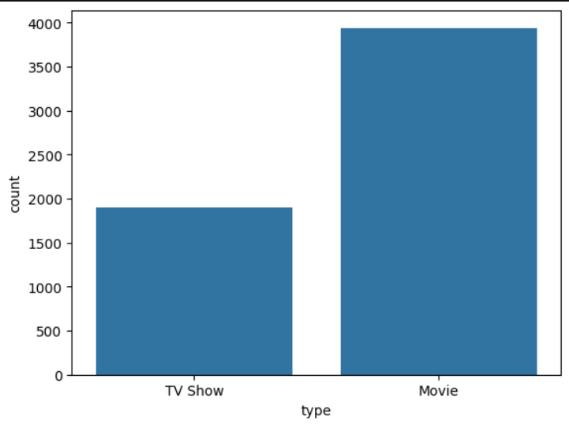
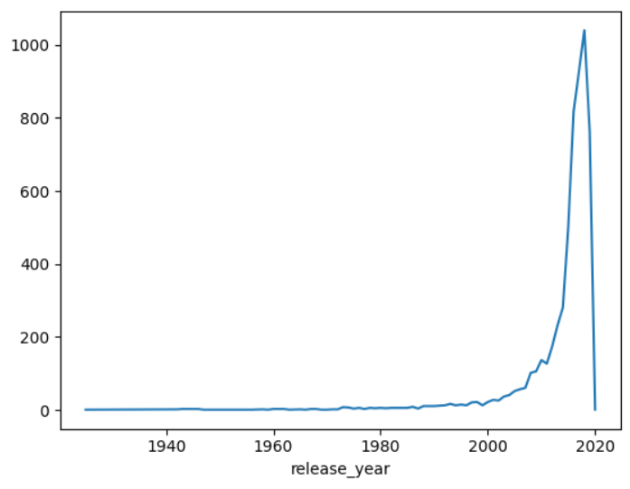
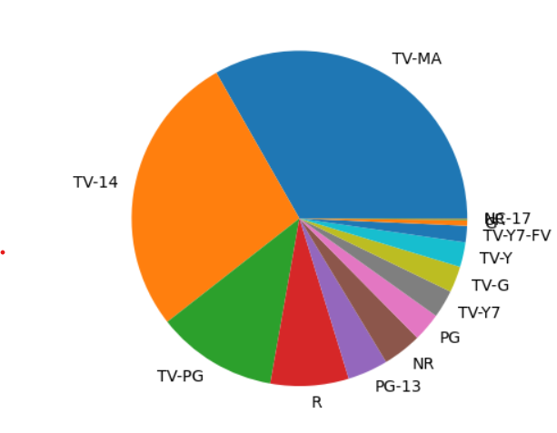
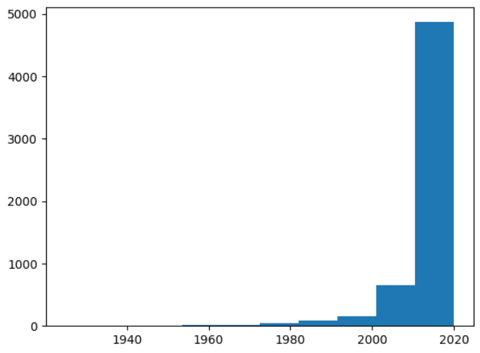
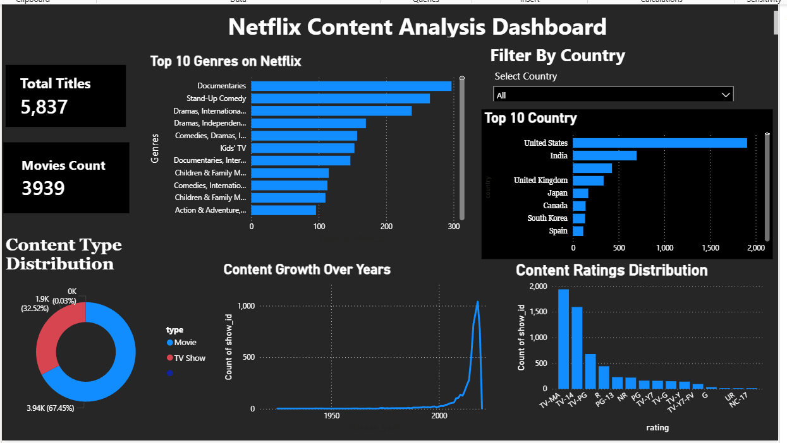

# 🎬 Streaming Analytics Dashboard
## 📌 Project Overview
This project focuses on performing **Exploratory Data Analysis (EDA)** on Netflix Movies and TV Shows data using Python and building an interactive **Power BI Dashboard**. The analysis was carried out to better understand streaming content trends, audience preferences, release patterns, and platform growth over time.
Using data analysis and visualization techniques, the project uncovers meaningful insights from the Netflix dataset and demonstrates practical skills in data cleaning, analysis, and storytelling with data.
---
# 🎯 Project Objectives
- Analyze the distribution of Movies and TV Shows
- Understand how Netflix content has grown over the years
- Explore content ratings and audience targeting
- Identify trends in release years and content patterns
- Practice real-world data analysis using Python libraries
- Build an interactive dashboard using Power BI
---
# 🛠️ Technologies Used
- Python
- Pandas
- Matplotlib
- Seaborn
- Jupyter Notebook
- Power BI
- Git & GitHub
---
# 📂 Dataset
The dataset used in this project contains information about Netflix Movies and TV Shows, including:
- Title
- Type
- Release Year
- Rating
- Country
- Duration
- Date Added
---
# 🧹 Data Cleaning
Before visualization and analysis, the dataset was cleaned by:
- Handling missing values
- Checking duplicate records
- Verifying data types
- Preparing columns for analysis and visualization
Data cleaning helped improve the accuracy and reliability of the analysis.
---
# 📊 Key Visualizations
## 1️⃣ Distribution of Movies and TV Shows
This visualization compares the number of Movies and TV Shows available in the dataset.

---
## 2️⃣ Trend of Content Releases Over the Years
This graph shows how Netflix content releases increased over time, especially after 2015.

---
## 3️⃣ Distribution of Content Ratings
This visualization highlights the most common content ratings available on the platform.

---
## 4️⃣ Distribution of Release Years
This histogram represents how content is distributed across different release years.

---
# 🖥️ Power BI Dashboard
An interactive Power BI Dashboard was built to provide a visual and dynamic view of the Netflix dataset.

### Dashboard Highlights:
- Total Titles and Movies Count cards
- Top 10 Genres on Netflix
- Top 10 Countries by content
- Content Type Distribution (Donut Chart)
- Content Growth Over Years
- Content Ratings Distribution
- Filter By Country slicer for interactive filtering

---
# 📈 Results & Insights
The analysis revealed several important insights about Netflix content:
- Movies are significantly more common than TV Shows in the dataset.
- Netflix content releases increased rapidly after 2015, showing major platform growth.
- TV-MA and TV-14 are among the most frequently occurring ratings, indicating a strong focus on mature audiences.
- Most content belongs to recent release years, showing Netflix's increasing investment in newer content.
- United States and India are the top countries contributing to Netflix content.
- Documentaries and Stand-Up Comedy are the most popular genres on the platform.
These insights help understand streaming platform trends and audience-focused content strategies.
---
# ✅ Conclusion
This project successfully demonstrated how data analysis and interactive dashboards can be used to extract meaningful insights from streaming platform data. By performing data cleaning, visualization, exploratory analysis, and building a Power BI dashboard, the project identified important trends related to content distribution, release patterns, and audience ratings.
The project also strengthened practical skills in:
- Data cleaning
- Exploratory Data Analysis (EDA)
- Data visualization
- Power BI Dashboard Development
- Git & GitHub workflow
Overall, this project provides a strong foundation for analytics and dashboard-based projects.
